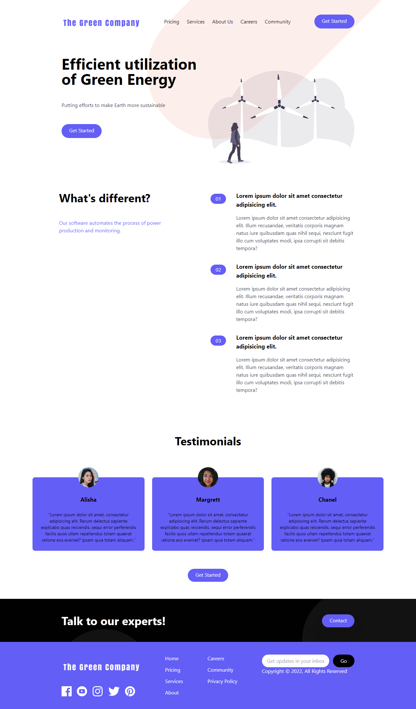

# Simple Responsive Landing Page
A mobile-first landing page for an energy company developed in HTML, Tailwind CSS with a little spice of JavaScript.

> Landing page link:  \
`https://landing-page-five.vercel.app`

### How to run?
- Clone the repo
- Install Tailwind CSS using `npm i`. Skip if you have already installed Tailwind CSS
- `npm watch` to run Tailwind in watch mode (for development purpose)
- `npm build` to build the files
### Website Screen Shot
